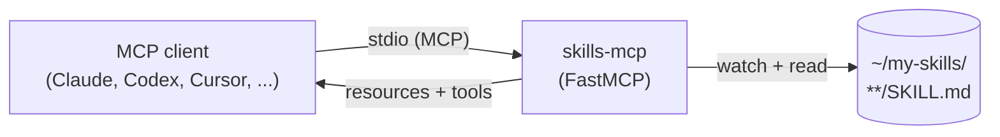

# skills-mcp

> Turn any folder of Markdown skill files into an MCP server that Claude Code, Claude Desktop, Codex, Cursor, and other MCP-compatible clients can use.

[](https://www.python.org/downloads/)
[](LICENSE)
[](https://modelcontextprotocol.io)
[](https://github.com/jlowin/fastmcp)

`skills-mcp` is a tiny [FastMCP](https://github.com/jlowin/fastmcp) server. Point it at a directory of `SKILL.md` files and every skill becomes an MCP resource (and, optionally, a tool) that any MCP client can list, read, and invoke. Add a new file → it shows up automatically. No registry, no plugin system, just a folder.

---

## What it does



Each subfolder of your skills root that contains a `SKILL.md` becomes one skill. Sibling files (e.g. `resources/example.json`) are exposed alongside it.

## Skill directory layout

```
~/my-skills/
├── code-review/
│   ├── SKILL.md
│   └── resources/
│       └── checklist.md
├── triage-incidents/
│   └── SKILL.md
└── write-pr-description/
    └── SKILL.md
```

A minimal `SKILL.md` is just Markdown — front-matter is optional but recommended:

```markdown
---
name: code-review
description: Review a diff for correctness, security, and style.
---

# Code review

When the user asks for a PR review, walk through the diff file-by-file and ...
```

## Install

Requires **Python 3.10+**.

### With [uv](https://github.com/astral-sh/uv) (recommended)

```bash
uv tool install git+https://github.com/anand-92/skills-mcp
```

### From source

```bash
git clone https://github.com/anand-92/skills-mcp
cd skills-mcp
uv sync          # or: pip install -e .
```

## Quick start

```bash
# 1. Put one or more SKILL.md files anywhere on disk
mkdir -p ~/my-skills/hello && cat > ~/my-skills/hello/SKILL.md <<'EOF'
---
name: hello
description: Say hi.
---
Say hi to the user in a friendly tone.
EOF

# 2. See what the server will expose
SKILLS_ROOT=~/my-skills skills-mcp --list

# 3. Run the server
SKILLS_ROOT=~/my-skills skills-mcp
```

The server speaks MCP over stdio, so it is normally launched by your MCP client (see snippets below) rather than by hand. Use `--list` whenever you want to debug what is being discovered without booting the full server.

## Configuration

Every option is an environment variable. All are optional.

| Variable | Default | Description |
| --- | --- | --- |
| `SKILLS_ROOT` | `~/my-skills` | One or more directories to scan. Separate multiple paths with the OS path separator (`:` on macOS/Linux, `;` on Windows). The server fails fast if any path is missing. |
| `SKILLS_MAIN_FILE_NAME` | `SKILL.md` | Filename that marks a skill folder. Every folder containing this file (at any depth under a root) becomes a skill. |
| `SKILLS_SERVER_NAME` | `skills` | Name advertised to MCP clients. |
| `SKILLS_RESOURCE_SCHEME` | `skill` | URI scheme for registered resources, e.g. `skill://<slug>/SKILL.md`. |
| `SKILLS_EXPOSE_TOOLS` | `true` | Also register each skill as an MCP **tool** named `skill_<slug>`. Set to `false` to expose skills as resources only. |
| `SKILLS_LOG_LEVEL` | `INFO` | Server log level (`DEBUG`, `INFO`, `WARNING`, `ERROR`, `CRITICAL`). |

See [`.env.example`](.env.example) for a copy-pasteable template.

### What gets exposed

For a skill folder like `my-skills/translate/` containing `SKILL.md` and `resources/glossary.md`, the server registers:

- **Resource** `skill://translate/SKILL.md` — the skill prompt itself.
- **Resource** `skill://translate/resources/glossary.md` — every sibling file under the skill folder.
- **Tool** `skill_translate` — returns the contents of `SKILL.md` when invoked, so clients that prefer tools can load the skill directly.

The skill's `name` and `description` are taken from the YAML frontmatter at the top of `SKILL.md` when present; otherwise the folder name and the first prose paragraph are used.

### Multi-root example

```bash
SKILLS_ROOT="$HOME/my-skills:$HOME/work/team-skills" skills-mcp
```

## Connecting from MCP clients

### Claude Code

```bash
claude mcp add skills -- skills-mcp
```

Or, equivalently, in `~/.claude/mcp.json`:

```json
{
  "mcpServers": {
    "skills": {
      "command": "skills-mcp",
      "env": { "SKILLS_ROOT": "/Users/you/my-skills" }
    }
  }
}
```

### Claude Desktop

Edit `~/Library/Application Support/Claude/claude_desktop_config.json` (macOS) or `%APPDATA%\Claude\claude_desktop_config.json` (Windows):

```json
{
  "mcpServers": {
    "skills": {
      "command": "skills-mcp",
      "env": { "SKILLS_ROOT": "/Users/you/my-skills" }
    }
  }
}
```

### Codex CLI

In `~/.codex/config.toml`:

```toml
[mcp_servers.skills]
command = "skills-mcp"
env = { SKILLS_ROOT = "/Users/you/my-skills" }
```

### Cursor

In `~/.cursor/mcp.json` (or `.cursor/mcp.json` per-project):

```json
{
  "mcpServers": {
    "skills": {
      "command": "skills-mcp",
      "env": { "SKILLS_ROOT": "/Users/you/my-skills" }
    }
  }
}
```

> **Tip:** if `skills-mcp` is not on the client's `PATH` (common with `uv tool install`), use the absolute path, e.g. `~/.local/bin/skills-mcp` or `uv run --project /path/to/skills-mcp skills-mcp`.

## Authoring a skill

There is no required schema beyond "a folder with a `SKILL.md` in it". A good skill:

- **Names itself** in front-matter so clients can list it cleanly.
- **Describes when to use it** in one or two sentences — that text is what the model reads to decide whether to invoke the skill.
- **Keeps prompts focused.** One skill, one job.
- **Pulls in supporting files via `resources/`** rather than hard-coding long examples inline.

Example with a supporting file:

```
~/my-skills/translate/
├── SKILL.md
└── resources/
    └── glossary.md
```

## Security notes

- The server reads files under `SKILLS_ROOT`. Anything in those folders is visible to the connected MCP client and, through it, to the model. **Do not put secrets, `.env` files, or credentials inside a skills root.**
- Prefer the default `SKILLS_SUPPORTING_FILES=resources`. The `template` mode inlines file contents into prompts, which is more powerful but also a larger blast radius if you drop the wrong file in.
- `skills-mcp` does not make network calls of its own. Anything network-related lives in the FastMCP transport.

## Troubleshooting

| Symptom | Fix |
| --- | --- |
| `SKILLS_ROOT path(s) not found` at startup | The directory does not exist. Create it, fix the env var, or unset it to use the default `~/my-skills`. |
| Client says "no skills available" | Make sure each skill folder contains a file literally named `SKILL.md` (check `SKILLS_MAIN_FILE_NAME` if you changed it). Run `skills-mcp --list` to confirm what the server can see. |
| Edits to a skill are not picked up | Skills are discovered at startup. Restart the MCP client (or the server) after adding or renaming a skill. |
| `skills-mcp: command not found` | Either install with `uv tool install` and ensure `~/.local/bin` is on your `PATH`, or call it via the absolute path in your MCP client config. |
| Duplicate slug warnings | Two skill folders normalize to the same slug. Rename one of the folders or set a unique `name:` in its frontmatter. |

## Contributing

PRs welcome. The project is intentionally small.

```bash
git clone https://github.com/anand-92/skills-mcp
cd skills-mcp
uv sync
uv run python -m skills_mcp --version
```

Open an issue first if you are planning a non-trivial change.

## License

[Apache-2.0](LICENSE) © anand-92
