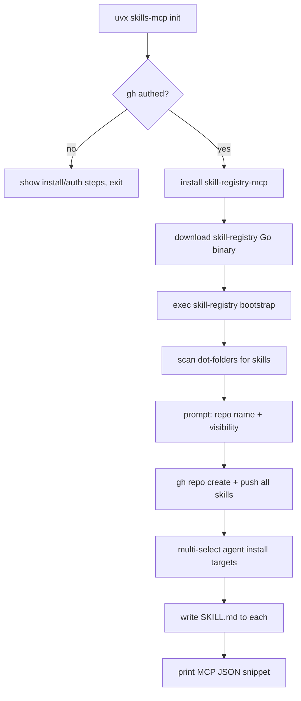

# skills-mcp

> Your AI skills, **in a GitHub repo you own**, fetched on demand. One command bootstraps the repo, installs a Go-powered TUI, and wires every MCP-compatible client into your personal skill registry. No more skills auto-loading into every agent's startup context.

[](https://github.com/anand-92/skills-mcp/actions/workflows/ci.yml)
[](https://www.python.org/downloads/)
[](LICENSE)
[](https://modelcontextprotocol.io)
[](https://github.com/jlowin/fastmcp)

`skills-mcp` turns a single GitHub repository into your personal skill registry. Run one command and you get:

1. A new private (or public) `skill-registry` repo on your GitHub account, pre-populated with every skill we found in your AI tool dot-folders.
2. A Charmbracelet-powered Go TUI (`skill-registry`) for browsing, downloading, syncing, adding, and publishing skills.
3. A FastMCP server (`skill-registry-mcp`) that exposes the registry to any MCP client through three tools: `list_skills`, `get_skill`, `publish_skill`.
4. A generated `skill-registry/SKILL.md` installed into every AI tool dot-folder you select, teaching each agent how to fetch skills on demand instead of loading them all at startup.

---

## Why this redesign

Every AI tool ships its own skills folder. Pre-loading 20+ skills into every agent's context window wastes tokens at startup. And the same skill ends up duplicated across `~/.claude/skills`, `~/.factory/skills`, `~/.cursor/skills`, …

This version reverses the model:

- **Skills live in one GitHub repo** you own — single source of truth, versioned, sharable.
- **Agents fetch on demand** via MCP tools (or CLI) rather than auto-loading.
- **One tiny `SKILL.md` per agent** is the only thing that auto-loads; it teaches the agent to discover and fetch the rest.

---

## Quick start

You need [GitHub CLI](https://cli.github.com/) authenticated (`gh auth status` should succeed).

```bash
# Install + bootstrap in one command:
uvx skills-mcp init
```

What happens:



After it finishes, paste the printed MCP JSON into your client of choice and you're done.

---

## The Go CLI: `skill-registry`

Everything you need day-to-day lives in this binary. Built with Charmbracelet (Bubble Tea + Lip Gloss + Bubbles).

| Command | What it does |
|---|---|
| `skill-registry list` | Fuzzy-filterable list of every skill in the registry. Enter shows the description. |
| `skill-registry get <slug>` | Downloads a skill into `./skill-registry/<slug>/` (or `--dest`). |
| `skill-registry sync` | Scans your dot-folders, multi-selects which skills aren't yet in the registry, pushes them. |
| `skill-registry add <source>` | `<source>` = local path, `owner/repo`, or git URL. Clones, multi-selects, pushes to **registry** (not local). |
| `skill-registry publish <path>` | Publishes one local skill folder. |
| `skill-registry bootstrap` | The same flow `skills-mcp init` runs. Safe to re-run. |

---

## The MCP server: `skill-registry-mcp`

Three tools, designed for desktop MCP clients (Claude Desktop, Cursor, VS Code/Copilot) whose process environment doesn't inherit your shell `PATH`:

| Tool | Behavior |
|---|---|
| `list_skills` | Returns a markdown table of every skill (slug, name, description). |
| `get_skill(slug)` | Downloads the skill into a local cache (`~/.cache/skills-mcp/skills/<slug>/`) and returns the absolute path. Cache is keyed on the registry's tree SHA so repeat calls are free. |
| `publish_skill(name, files \| local_folder)` | Atomically replaces `<slug>/` in the registry via the Git Data API (no `git` binary, no SSH agent). Retries on non-fast-forward. |

It locates `gh` itself (PATH first, then `~/.local/bin`, `/opt/homebrew/bin`, `/usr/local/bin`, `/usr/bin`) so it Just Works in GUI launchers.

---

## How to configure clients

`skills-mcp init` prints platform-correct JSON, but here are the canonical forms:

### Claude Code / Claude Desktop / Cursor / VS Code (`mcp.json`)
```json
{
  "mcpServers": {
    "skill-registry": {
      "command": "/Users/you/.local/bin/skill-registry-mcp"
    }
  }
}
```

### Codex (`~/.codex/config.toml`)
```toml
[mcp_servers.skill-registry]
command = "/Users/you/.local/bin/skill-registry-mcp"
```

The registry repo URL is stored in `~/.config/skills-mcp/registry.toml` (override per-process via `SKILLS_REGISTRY=owner/repo[@branch]`).

---

## Configuration

| Variable | Default | Description |
|---|---|---|
| `SKILLS_REGISTRY` | (from config file) | `owner/repo` or `owner/repo@branch`. Overrides the on-disk config for one process. |
| `XDG_CONFIG_HOME` | `~/.config` | Where `registry.toml` lives. |
| `XDG_CACHE_HOME` | `~/.cache` | Where `get_skill` caches downloads. |
| `SKILLS_BIN_DIR` | `~/.local/bin` | Where `skills-mcp init` installs the Go binary. |
| `SKILLS_CLI_REPO` | `anand-92/skills-mcp` | GitHub repo to download CLI releases from. |
| `SKILLS_MAX_FILE_BYTES` | `2097152` | Per-file size limit for `publish_skill`. |
| `SKILLS_LOG_LEVEL` | `INFO` | Log level for the MCP server. |

---

## Security

- The MCP server **never shells out to `git`** — all writes go through the GitHub Git Data API via authenticated `gh api` calls. This sidesteps missing SSH agents, missing `user.email`, and credential helper drama in GUI MCP clients.
- `gh` authentication is the only trust anchor. If `gh auth status` fails, every command exits before touching the network.
- `publish_skill` rejects paths with `..` segments and skips hidden files (`.DS_Store`, `.git`, `__pycache__`).
- The Go CLI uses identical logic for parity.

---

## Legacy: local-folder MCP server

The previous `skills-mcp serve` / `skills-mcp list` flow still works for users who haven't migrated. It scans `SKILLS_ROOT` (default `~/my-skills`) and serves any `SKILL.md` it finds. The old `gather` and `add` subcommands were removed in 0.3.0 — `skills-mcp init` and the new CLI cover all of their use cases.

---

## Development

```bash
git clone https://github.com/anand-92/skills-mcp
cd skills-mcp

# Python
uv sync --group dev
uv run pytest -v --cov=skills_mcp --cov-report=term-missing
uv run ruff check .
uv run ruff format --check .

# Go CLI
cd cli
go build ./...
go test ./...
go vet ./...
```

See [`docs/registry.md`](docs/registry.md) for a deep dive into the architecture, and [`AGENTS.md`](AGENTS.md) for contributor notes.

---

## License

[Apache-2.0](LICENSE) © anand-92
