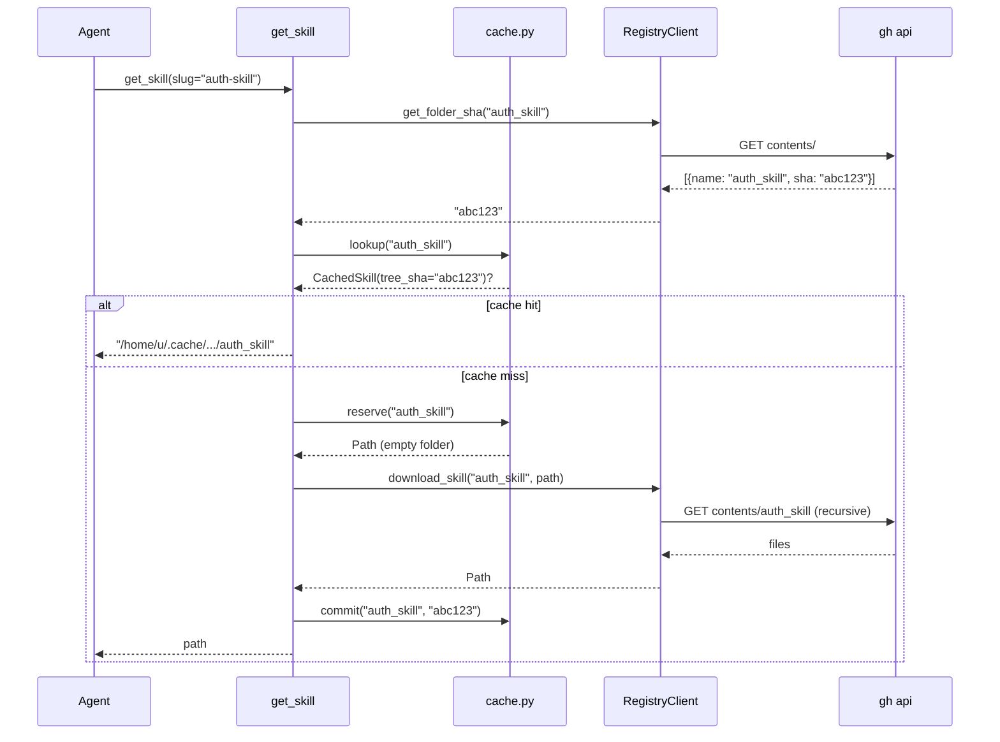

# Caching

Active contributors: Nik Anand

## What it does

The Python MCP server caches every skill it downloads at `~/.cache/skills-mcp/skills/<slug>/` so subsequent `get_skill` calls can skip the network round-trip. Each cached folder has a sibling `~/.cache/skills-mcp/skills/<slug>.meta.json` that records the registry's tree SHA at the time of download. The next request asks the registry for the current tree SHA; if it matches the cached value the server returns the cached path immediately, otherwise it wipes the folder and re-downloads.

The cache module is Python-only at runtime. The Go side carries an identical path resolver (`cli/internal/cache/cache.go`) but never reads or writes the directory — its only consumer is the Settings view in the dashboard hub, which displays the path so the user can inspect or clean it manually.

## Layout

```
~/.cache/skills-mcp/skills/
├── auth-skill/                  # cached files for slug "auth-skill"
│   ├── SKILL.md
│   └── resources/example.md
├── auth-skill.meta.json         # {"tree_sha": "abc123…"}
├── csv-export/
│   └── SKILL.md
└── csv-export.meta.json
```

The folder name is the slug. The meta filename is `<slug>.meta.json` — kept as a sibling rather than inside the slug folder so a `client.download_skill` call that overwrites the folder's contents doesn't have to special-case preserving it. The two are committed together: write the folder, then write the meta file. Read the same way: stat the folder, then read the meta.

## XDG honor

`cache_root()` consults `XDG_CACHE_HOME`:

```python
def cache_root() -> Path:
    base = os.environ.get("XDG_CACHE_HOME")
    root = Path(base).expanduser() if base else Path.home() / ".cache"
    return root / "skills-mcp" / "skills"
```

When `XDG_CACHE_HOME=/foo`, the cache lives at `/foo/skills-mcp/skills/`. Without the env var we use the conventional `~/.cache/skills-mcp/skills/`. The Go mirror in `cli/internal/cache/cache.go:CacheRoot` applies the same rules so the path shown in the Settings TUI matches what the MCP server actually uses at runtime.

## The API: `lookup` / `reserve` / `commit`

The cache module exposes three functions in `src/skills_mcp/cache.py`:

| Function | Returns | What it does |
| --- | --- | --- |
| `lookup(slug)` | `CachedSkill \| None` | Stat the folder and read the meta file. Returns `None` when either is missing or the meta is malformed. |
| `reserve(slug)` | `Path` | Wipe any previous folder, recreate empty, return the path. Used right before re-downloading. |
| `commit(slug, tree_sha)` | `None` | Write `<slug>.meta.json` with `{"tree_sha": "..."}`. Called after the download finishes. |

A `CachedSkill` carries three fields: `slug`, `path`, and `tree_sha`. The dataclass is frozen so callers can pass it around without worrying about mutation.

The split lets the caller decide when each step happens. The MCP server's `get_skill` tool sequences them like this:



## Tree-SHA invalidation

The cache key is the registry's tree SHA for `<slug>/`, not a timestamp or a file hash. GitHub's contents API returns the SHA of every directory entry as part of the parent listing:

```json
[
  {"name": "auth_skill", "type": "dir", "sha": "abc123..."},
  {"name": "csv_export", "type": "dir", "sha": "def456..."}
]
```

`RegistryClient.get_folder_sha(slug)` reads that listing and returns the slug's tree SHA. The MCP server compares it to the cached meta's `tree_sha`. They match exactly when the folder's content (and the content of every descendant) is byte-identical to what we last downloaded.

What this catches:

- A new file added to `<slug>/` — the tree SHA changes.
- An existing file edited — the tree SHA changes (because the blob SHA changes, which changes the tree).
- A file removed — the tree SHA changes.
- A force-push that rewinds the registry to an older state — the tree SHA changes.
- A force-push that overwrites with a different version of the same files — the tree SHA changes.

What it doesn't catch:

- Network failures during the SHA fetch. The MCP server treats a fetch error as "not found"; the next call will retry.
- A folder with the same content as a previously-downloaded version (e.g. revert). The cache invalidates and re-downloads even though the bytes match — this is wasteful but harmless. The tree SHA is the cheapest correct signal we have without doing per-file diffing.

## Why not the Go side too

Caching only matters for `get_skill` (the only reader called repeatedly with the same slug). The Go CLI's `get` subcommand is invoked by a human typing a command, typically once per slug per session, so the cache wouldn't pay for itself. The Go `cache.CacheRoot()` function exists purely so the Settings TUI in the hub can show the user the same absolute path the MCP server is reading from — clicking that line opens it in Finder / Files.

If a future CLI flow (a `watch` mode, a daemon) ever needs the cache, the Python implementation should be considered the canonical one and ported to Go rather than re-invented.

## Failure modes

- **Malformed meta file.** A JSON parse error in `<slug>.meta.json` causes `lookup` to return `None`, which triggers a fresh download. The bad meta is overwritten by the next `commit`.
- **Missing tree SHA field.** Same as above — `lookup` returns `None`.
- **Folder present, meta missing.** Same. We treat the folder as untrusted and re-download.
- **Meta present, folder missing.** Same. We re-download.
- **Permission denied on the cache root.** `reserve` calls `mkdir(parents=True, exist_ok=True)` which raises `PermissionError`. The MCP server propagates it; the user sees the error in the agent's tool-call output and knows to chmod the cache dir.

There is no LRU eviction. The cache grows monotonically until the user clears it manually. Skill folders are small (typically <1 MB each), and the registry maximum file size is 2 MiB, so even a power user with 200 skills caches at most a few hundred megabytes.

## Key source files

| File | Role |
| --- | --- |
| `src/skills_mcp/cache.py` | The canonical implementation. Owns `cache_root`, `lookup`, `reserve`, `commit`, and the `CachedSkill` dataclass. |
| `cli/internal/cache/cache.go` | Go mirror of `cache_root()` for the Settings TUI. Never reads or writes. |
| `src/skills_mcp/registry_server.py` | `get_skill` tool — the only consumer of the three-function API. |
| `src/skills_mcp/registry_api.py` | `RegistryClient.get_folder_sha` — what we compare against the cached tree SHA. |

## Cross-links

- [Registry client](registry-client.md) — the SHA-fetch endpoint and the `download_skill` body.
- [MCP server](../apps/mcp-server.md) — the `get_skill` tool that wraps the cache.
- [Architecture](../overview/architecture.md) — where the cache sits in the boot flow.
