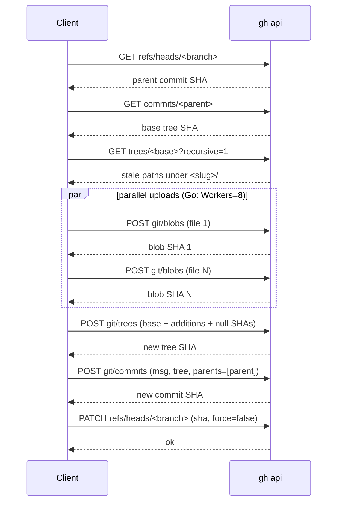

# Registry client

Active contributors: Nik Anand

## What it does

The registry client is the wrapper around `gh api` that every read and single-skill write goes through. Both the Python MCP server and the Go CLI carry an implementation of the same contract: list the skills in a GitHub registry repo, download one slug into a destination folder, publish a slug atomically, and delete a slug atomically. The Python implementation is `RegistryClient` in `src/skills_mcp/registry_api.py`; the Go implementation is `registry.Client` in `cli/internal/registry/registry.go`. Both shell out to the user's authenticated `gh` CLI for every HTTP call — there is no embedded HTTP client, no `git` dependency, no SSH agent dependency.

The bulk-import path used by the wizard takes a different route entirely; see [bootstrap-push](bootstrap-push.md).

## Why `gh api`

Desktop MCP clients (Claude Desktop, Cursor, VS Code) spawn the MCP server in a stripped environment: no shell `PATH` extensions, no `SSH_AUTH_SOCK`, possibly no `git config user.email`. Anything that assumed those were configured would fail on launch. `gh api` only needs `gh` itself plus the token its config keeps, which the user already wired up with `gh auth login`. The Go CLI uses the same path for consistency — the MCP server and the CLI behave identically on every read and single-skill write.

## Slugify

Slugs are the registry's canonical identifier for a skill. Both implementations normalize a display name with the same regex (`[^a-z0-9]+` → `_`), trim leading and trailing underscores, and fall back to `"skill"` for an empty result. Python: `registry_api.slugify`. Go: `scan.Slugify` (in `cli/internal/scan/scan.go`). The function is identical in both languages so a skill named `"AGP-9 Upgrade"` always slugifies to `agp_9_upgrade` regardless of which side did the normalization.

## Reads: `list_skills` and `download_skill`

`list_skills` returns one `SkillSummary` (Python) / `Summary` (Go) per top-level folder. The implementation calls `GET /repos/{r}/contents/` to enumerate folders, then for each folder fetches `<slug>/SKILL.md` and parses its frontmatter for `name` and `description`. Hidden folders (leading `.`) and a small skip-list (`node_modules`, `__pycache__`) are filtered. The result is sorted by slug for stable output.

`download_skill` walks `<slug>/` recursively through `GET /repos/{r}/contents/{path}` and writes each file under the destination directory. Files are returned base64-encoded; the client decodes them and writes raw bytes. The MCP server uses this through the cache layer (see [caching](caching.md)); the CLI's `get` subcommand uses it directly.

## Writes: the 6-call publish sequence

A publish replaces `<slug>/` atomically. The client constructs a new Git commit object that references a tree containing the old tree plus the new file blobs, then fast-forwards `refs/heads/<branch>` to point at it. Six calls per publish:

The tree payload contains both additions (entries with a blob SHA) and deletions (entries with `"sha": null`), so files removed in the new version are dropped from the tree in the same atomic operation. Two skill folders sharing the registry don't collide: a publish of `slug-a` leaves `slug-b/` untouched because the new tree is built `base_tree`-on-top-of the old one.

## Deletes: `Client.Delete`

`Client.Delete` (Go) and `RegistryClient`'s delete flow do an atomic slug removal using the same six-call sequence, except the new tree contains only null-SHA entries for every blob under `<slug>/`. If the slug has no files in the current tree, the client returns `ErrSlugNotFound` so the `remove` subcommand can surface a clean "not found" message instead of a generic API failure. The order of stale-path entries is deterministic (`sort.Strings(staleKeys)`) so the resulting tree payload is byte-identical across runs — useful for testability.

## Retries

Concurrent writes to the same branch race: two clients both fetch `parent_sha=X`, both build trees on top of it, and the second PATCH fails with a non-fast-forward error (409 or 422). The client handles this with a bounded retry budget. Defaults: `MaxRetries = 3`, `RetryBaseS = 0.5`. Backoff is exponential — sleep `0.5s`, then `1.0s`, then `2.0s` — and each retry re-fetches HEAD before rebuilding. After three retries, the client returns a `RegistryConflictError` (Python) or a wrapped error (Go) to the caller.

Only `409` and `422` are retried; every other status surfaces immediately.

## Parallel blob upload (Go)

Per-file `POST git/blobs` is the slowest part of a publish because each call is one round-trip. The Go implementation runs uploads through a worker pool, defaulting to 8 workers (`Client.Workers`). Workers consume from a single channel of `{rel, content}` jobs; the result channel collects `{rel, sha}` pairs, the caller assembles the tree from the result map. Progress is reported via `Client.OnProgress(done, total)` after each successful upload so the wizard's progress bar can advance.

The Python side uploads serially. Single-skill publishes are typically ≤10 files, so the serial cost is small; the Python server doesn't carry the worker-pool complexity.

## `bootstrapInitialCommit` (Go)

A brand-new repo created by `gh repo create` (without `--add-readme`) has no commits at all — the `GET refs/heads/main` call returns 404. The Go client detects this in `pushTree`, falls through to `bootstrapInitialCommit`, and uses `PUT /repos/{r}/contents/<first-file>` to seed the branch with one file (the alphabetically-first file in the payload). That call returns a commit SHA and creates `main` as a side effect. The remaining files then go through the normal `pushTree` path.

This is the fallback path; the wizard's primary route for first-time imports is `PushTreeViaGit`. See [bootstrap-push](bootstrap-push.md) for the reasoning.

## Key source files

| File | Role |
| --- | --- |
| `src/skills_mcp/registry_api.py` | Python `RegistryClient`: `list_skills`, `download_skill`, `publish_skill`, `_publish_once`, `_list_tree_paths_under`. |
| `cli/internal/registry/registry.go` | Go `registry.Client`: `List`, `Get`, `Publish`, `publishOnce`, `Delete`, `deleteOnce`, `uploadBlobs`, `bootstrapInitialCommit`. |
| `src/skills_mcp/gh.py` | `find_gh`, `gh_api`, `GhApiError`. |
| `src/skills_mcp/frontmatter.py` | Frontmatter parser used by `_parse_skill_md`. |

## Cross-links

- [Bootstrap push](bootstrap-push.md) — the other upload path, used for first-time bulk imports.
- [Caching](caching.md) — the MCP server's wrapper around `download_skill`.
- [Architecture](../overview/architecture.md) — how the two upload paths fit together.
- [MCP server](../apps/mcp-server.md) — the FastMCP tools that wrap this client.
- [CLI commands](../api/cli-commands.md) — the subcommands that consume it.
